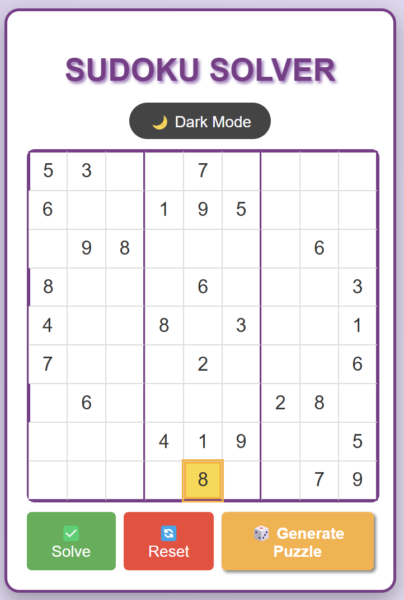
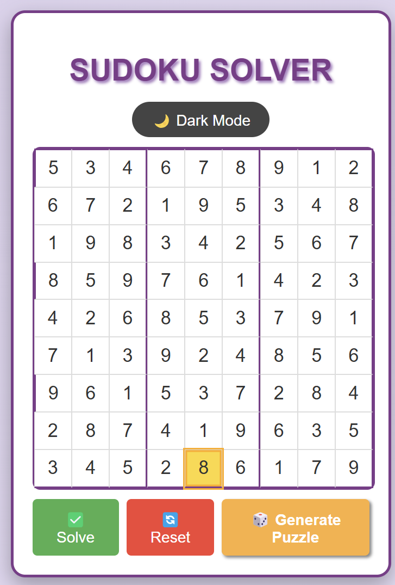

# Sudoku Solver

A clean and interactive Sudoku Solver built with React. It supports manual solving, random puzzle generation and smooth keyboard navigation.

## Preview




## Live Demo

[Try the Sudoku Solver here](https://sudoku-solver-gules.vercel.app/)

## Features

- **Instant Sudoku Solver** — Solves puzzles with a single click
- **Random Puzzle Generator** — Create new puzzles instantly (May be Solvable or Unsolvable)
- **Keyboard Navigation** — Move between cells using arrow keys
- **Dark Mode Support** — Toggle between light and dark themes

## Installation

1. **Clone the repository:**
   ```bash
   git clone https://github.com/naba-diganta03/Sudoku-Solver.git
   cd Sudoku-Solver
   ```

2. **Install project dependencies:**
   ```bash
   npm install
   ```

3. **Run the application locally:**
   ```bash
   npm start
   ```

## Deployment on Vercel

1. **Install the Vercel CLI:**
   ```bash
   npm i -g vercel
   ```

2. **Deploy the project:**
   ```bash
   vercel
   ```

3. **Update the "Live Demo" link with your deployment URL.**

## Tech Stack

- **Frontend:** React, CSS
- **Deployment:** Vercel

## Author

Developed by [Nabadiganta Acharjee](https://github.com/naba-diganta03)

---


